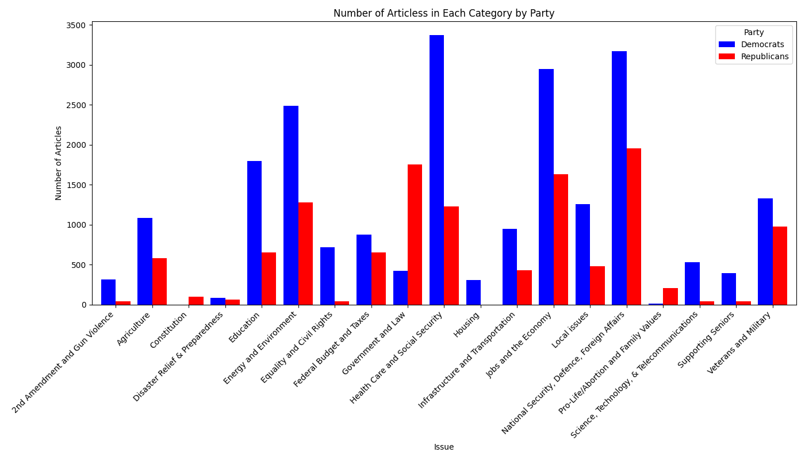
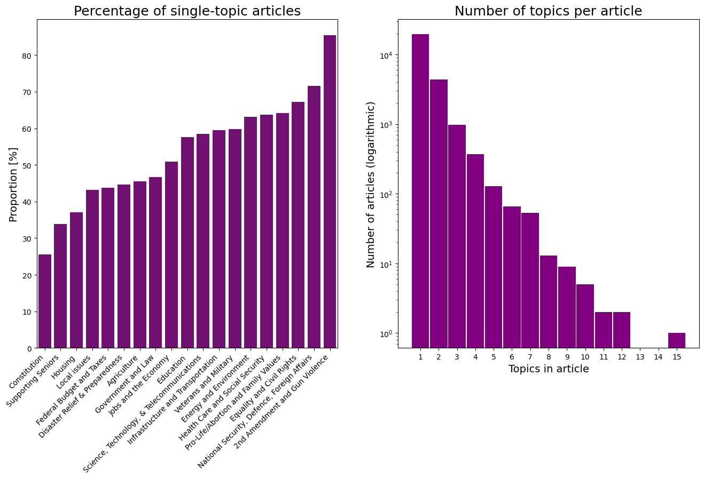
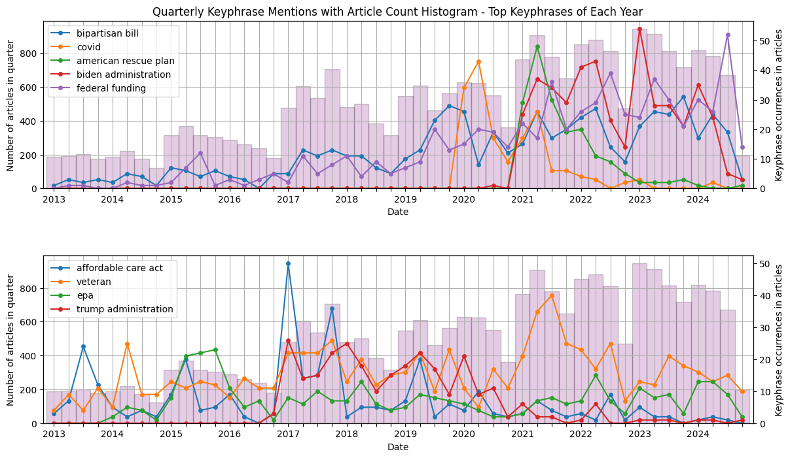

# Congressional Articles Mining

## Overview
Look at report.pdf and presentation.pdf files for details of this project.

## Project Overview 
This project employs data mining and machine learning techniques to analyze textual data produced
by U.S. Congress members, offering insights into political communication trends. By collecting a
comprehensive dataset of articles and statements from various U.S. Congressmen and Congresswomen,
we aim to explore key political patterns and their underlying motivations.

## Data

A list of all United States Representatives was compiled from the official House website: Directory of Representatives (https://www.house.gov/). This data includes each representative’s full name, district, state, committee assignments, party affiliation, and a link to their individual webpage. Many of these individual webpages contain a dedicated ”Issues” subpage where representatives outline the topics they address in their
published articles.





## Keyphrases over time




## How to run
```
python3 -m venv .venv
source .venv/bin/activate
pip install -r requirements.txt
```

